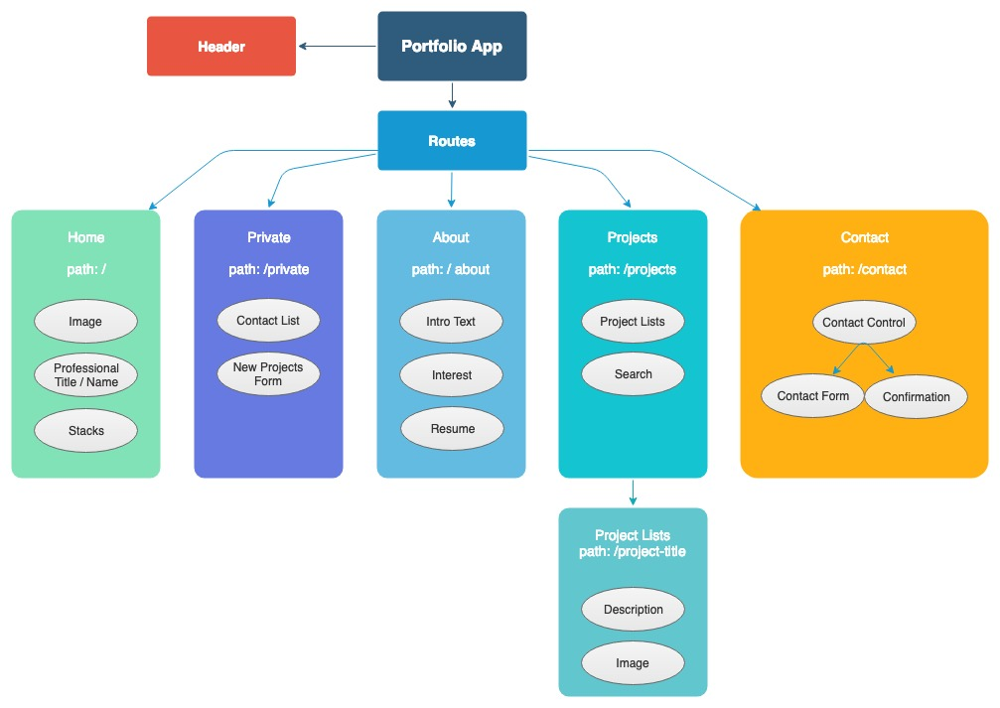

<h3 align="center"> Portfolio </h3>
<h4 align="center"> By Ngan Nguyen </h4>

## Description

_This portfolio was created with React and Material UI. The flow chart was created using draw.io ._

* Click here to view page "Link".

# 

## Table of content

- [Installation](#installation)
- [Features](#Features)
- [Technology](#technology)
- [License](#license)

## Installation

1. Go to terminal and clone this repository:
```
$ git clone git repository link
```
2. Change into the project directory and install npm
```
$ npm install
```
3. To run the program:
```
$ npm start
```
4. Open project  at http://localhost:8080/

## Features

## Completed Features
* About Component, contains intro and resume
* Home Component

## Planned Features
* Search function for projects base on key words
* Project component to show list of projects
* Contact component with contact form and confirmation messages
* Private component for internal use to see list of submitted contacts and form to add to Projects


## Technology
* Javascript
* React
* Material UI

## License
* This project is licensed under the MIT License - see the LICENSE.md file for details
