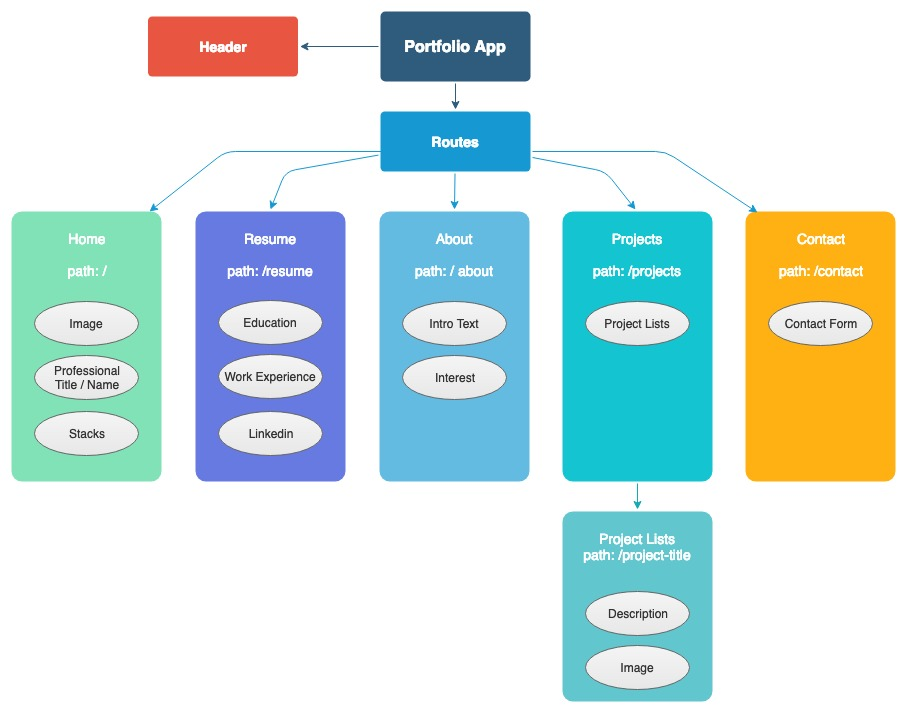

<h3 align="center"> Portfolio </h3>
<h4 align="center"> By Ngan Nguyen </h4>

## Description

_This portfolio was created with React and Material UI. The flow chart was created using draw.io ._

* Click here to view page "Link".

# 

## Table of content

- [Installation](#installation)
- [API Setup](#API)
- [Technology](#technology)
- [License](#license)

## Installation

1. Go to terminal and clone this repository:
```
$ git clone git repository link
```
2. Change into the project directory and install npm
```
$ npm install
```
3. Build the app:
```
$ npm run build
```
4.  To run the program:
```
$ ng serve
```

## API
Create a file in the app folder named api-keys.ts
* Firebase: Go to google firebase console, create a project and get the app API key. Add the API key to the format below and add to file api-keys.ts.
```
export const masterFirebaseConfig = {
  apiKey:
   authDomain:
   databaseURL:
   projectId:
   storageBucket:
   messagingSenderId:
  };
```
## Completed Features
* TBD


## Planned Features
* TBD

## Technology
* Javascript
* React
* Material UI

## License
* This project is licensed under the MIT License - see the LICENSE.md file for details
